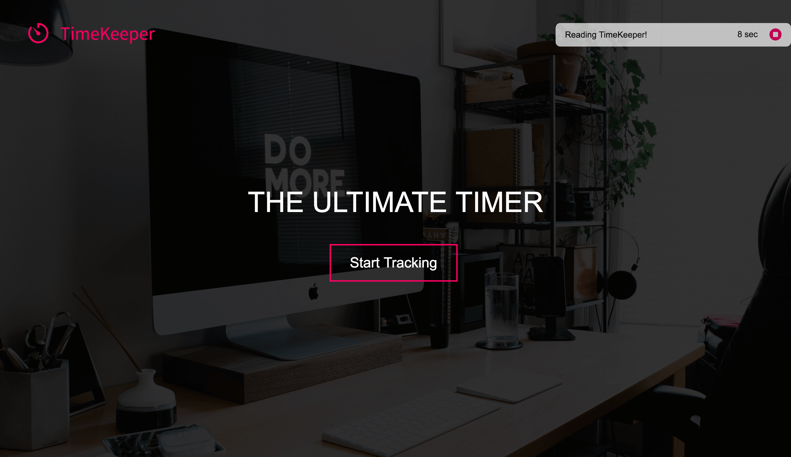
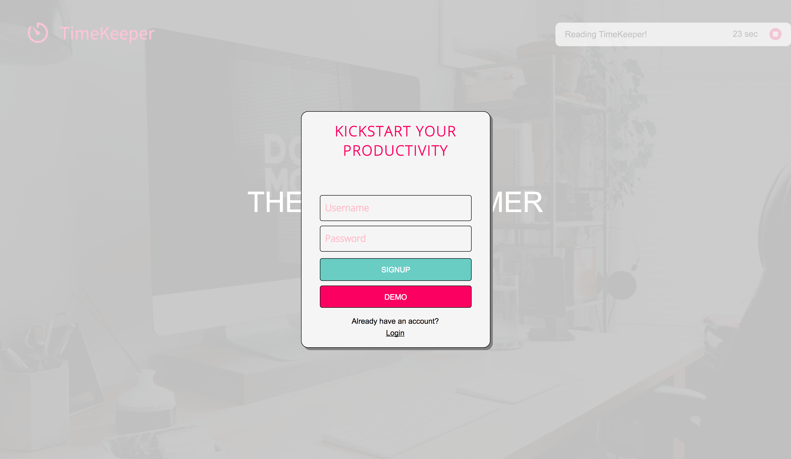
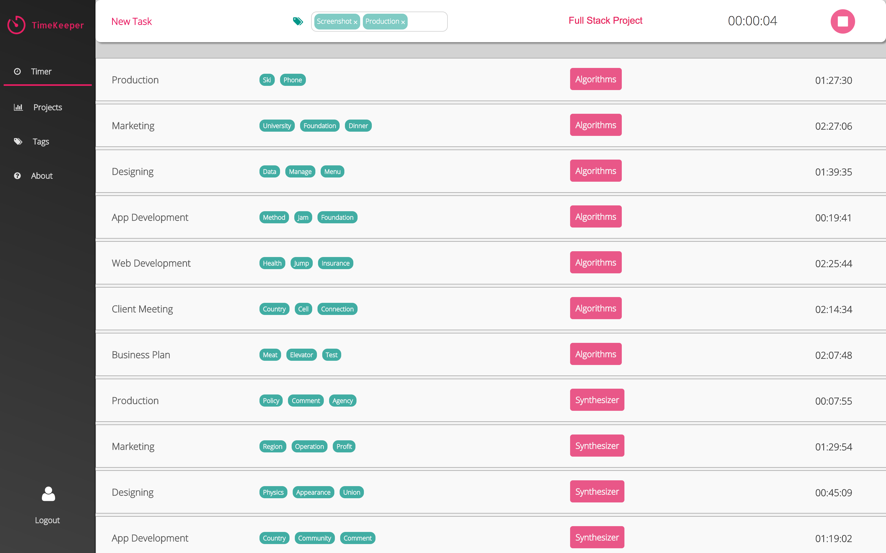
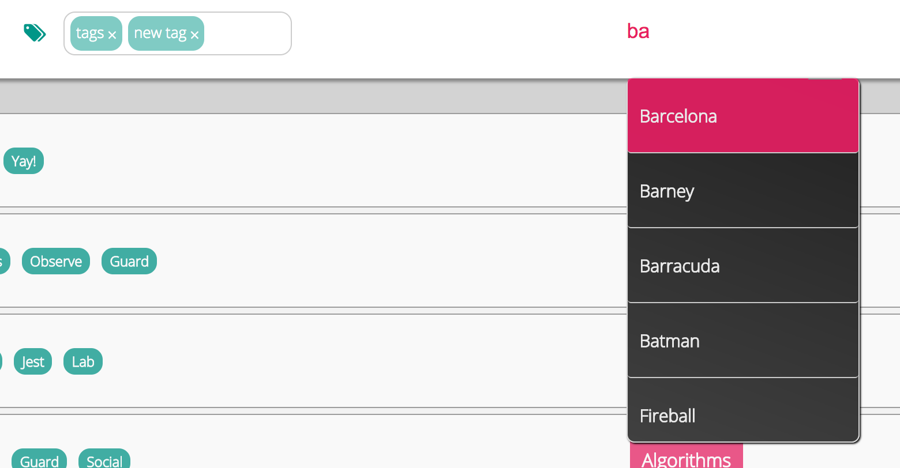
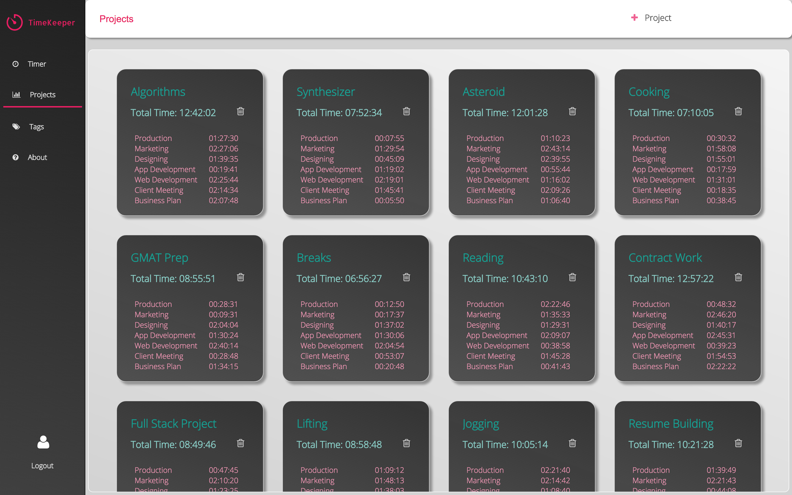
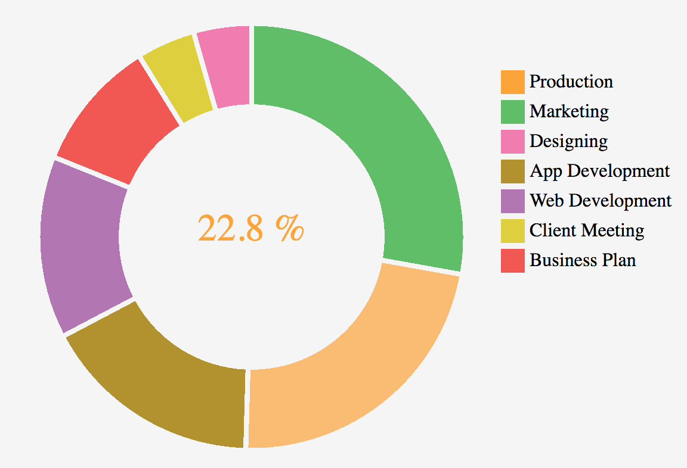

# TimeKeeper

[TimeKeeper Live][live]

[TimeKeeper][live] is a web application inspired by Toggl.com built using Ruby on Rails
and React/Redux. It offers features for users to search and create projects,
track time of each tasks, and data visualization of these tasks.

[TimeKeeper][live] is a personal project of Raymond Lee.

[live]: http://www.raymondlee.io/
[development]: ./docs/




## Features

### BCrypt Authentication

  Users can securely create accounts using BCrypt to securely hash and salt passwords before storing them in the database so that raw passwords are never stored.

  

### Time Tracking

  Users can create tasks and track time for each action.

  

### Search for projects and create tags

  Users can search for projects and create tags.

  

  lodash's `debounce` method was utilized for the search so that ajax requests are not sent off while a user is actively typing.  It waits until the user has stopped typing for 150ms before sending off the request.

  ```javascript
  const mapDispatchToProps = dispatch => ({
    searchProjects: _.debounce(search => dispatch(searchProjects(search)), 150)
  });
  ```

  ```javascript
  <form className="projects-search">
    <div className="form-group">
      <input type="text"
             onChange={this.updateSearchTerm}
             onClick={this.updateProjectTitle}
             placeholder="Search Project"
             value={this.state.searchTerm} />

      <ul style={{ display: this.state.searchTerm.length && !this.state.projectTitle ? 'block' : 'none' }}>
        <li style={{ display: (!this.props.searchResults && this.state.searchTerm) || this.props.searchResults.length === 0 ? 'list-item' : 'none' }}>
          No search results
        </li>

        { this.props.searchResults ?
           Object.keys(this.props.searchResults).map( (id) =>
           <li key={id}
             onClick={() => {
               this.props.handleSearchProject(this.props.searchResults[id].id);
               this.updateProjectTitle();
               this.setState({searchTerm: this.props.searchResults[id].title});
             }}>
               {this.props.searchResults[id].title}
           </li> ) : ""
         }
      </ul>
    </div>
  </form>
  ```

### View projects listed in order by creation date

  Users can create and view projects.

  

### Data visualization of projects and tasks

  Users have access to analyzed data of their projects and tasks with time spent in pie chart and bar graphs.

  

  D3 was used to develop live piechart with legends and hover effects.

  

  ```javascript
  class DataSeries extends React.Component {
  render() {
    const color = this.props.colors;
    const data = this.props.data;
    const width  = this.props.width;
    const height = this.props.height;
    const pie = d3.layout.pie().padAngle(.02);
    const result = data.map(item => item.count);
    const names = data.map(item => item.name);
    const sum = result.reduce(((memo, num) => memo + num), 0);
    const position = "translate(" + (width)/2 + "," + (height)/2 + ")";
    const bars = (pie(result)).map((point, i) => {
      return (
        <Sector data={point}
                key={i}
                ikey={i}
                name={names[i]}
                colors={color}
                total={sum}
                width={width}
                height={height}/>
      );
    });

    return (
      <g transform={position}>{bars}</g>
    );
  }
}
  ```

  Recharts was used to create barchart with animation.

  

## Product Design

TimeKeeper was built in two weeks including the creating the [development plan][development].  The [development plan][development] includes the estimated timeline, planned database schema, along with the original wireframes and other planning documents.

## Technology

TimeKeeper utilizes Ruby on Rails for the back end API and React.js for the front end.

### Front end
TimeKeeper is a single page app.

The following is a list of some of the technologies used to create the TimeKeeper front end.

* **React.js** is the framework used for the entirety of the front end.
* **React Router** is used to update the view based on the URL path.
* **Redux** is utilized to store the bulk of the data needed on the client-side, and to trigger API calls as needed.
* **Sass** is used to better organize the CSS.
* **jQuery** is used for ajax calls.
* **webpack** is used to bundle and minify javascript files.
* **Babel** is used to translate jsx into javascript.

### Back end
TimeKeeper makes asynchronous http requests to the back end to create, fetch, update, and delete data.

The following is a list of some of the technologies used to create the TimeKeeper back end.

* **Ruby on Rails** is the framework used for the back end, creating models that interact with the database, controllers that contain methods to respond to http requests, a router that maps routes to those controller methods, and jbuilder views to respond to requests with JSON data.
* **Heroku** hosts TimeKeeper.
* **BCrypt** is used to securely hash and salt passwords before storing them in the database so that raw passwords are never stored.
* **Cloudinary** is where the images are stored.

## Future Implementation

There are many features planned for TimeKeeper, including the following:

* **Coworkers** Users will be able to add coworkers to projects to share the data.
* **Messaging** Users will be able to send messages to each other and see responses in real time.
* **Notifications** Users will see when one of their coworkers messages or comments on their projects.
